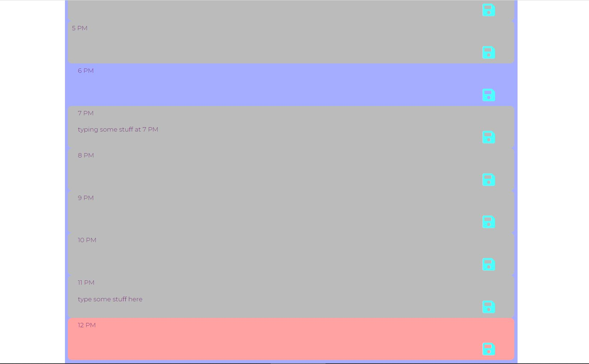

# Workday Scheduler
## software specifications
- current hour of the day is highlighted for easy focus
- allow user to save events for each hr of the day
- user data is persistant and stored in local storage

### Links
[Link to deployed page](https://ernesturzua.github.io/workday-scheduler/ "app website")    	  
[Link to Github repo](https://github.com/ErnestUrzua/workday-scheduler "Github Repo")

## Technologies
- Javascript
- CSS
- Bootstrap
- Jquery
- momement.js

## Screenshots

